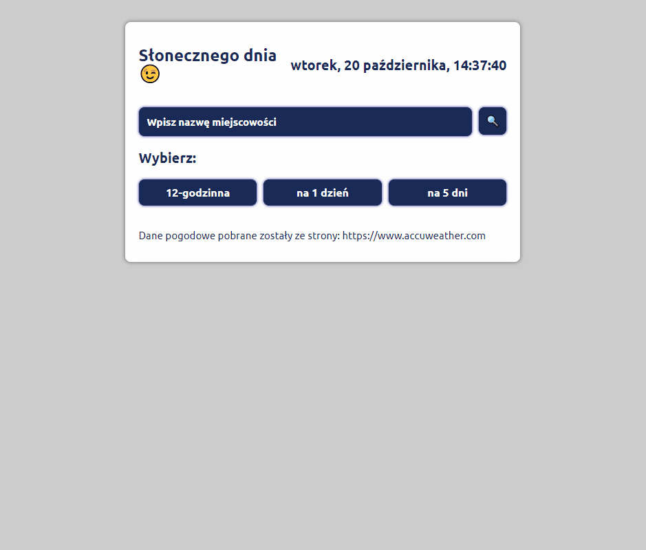

# Weather app

My weather app allows you to check current, one day, five days and twelve hours weather.

## Where can I find this app?

Below I attached link to this website:

[Weather](https://anetaszynal.github.io/weather/)

## Now, see how to use

## Description

You'll find there:
- welcome screen, where you should enter the name of the city for which you want to check the weather,
- three weather display options,
- if you don't select any options, you will see default view,
- if you want, you can change the city name or display options at any time.

**Technologies, libraries and methodologies used:**

- HTML
- CSS
- Styled components
- JavaScript
- React.js
- Hooks (also custom hooks)
- JSX
- API

## How to use?

1. Enter the name of the city for which you want to check the weather,
2. Choose from three weather display options,
3. Check the weather.

This project was bootstrapped with [Create React App](https://github.com/facebook/create-react-app).
